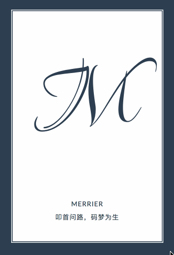

# web-demo-mobile
总结了一些SVG实现的demo效果

## 其他示例
由于示例比较多，放在一个工程中打开的时候加载很慢，所以我将`web-demo`分成了多个repo，具体列表如下：

* [web-demo-js](https://github.com/merrier/web-demo-js)
* [web-demo-css](https://github.com/merrier/web-demo-css)
* [web-demo-mobile](https://github.com/merrier/web-demo-mobile)
* [web-demo-canvas](https://github.com/merrier/web-demo-canvas)
* [web-demo-svg](https://github.com/merrier/web-demo-svg)

## 目录

### 有趣的边框动画

[出处](https://www.w3cplus.com/svg/creating-a-border-animation-effect-with-svg-and-css.html)
[在线演示](http://merrier.github.io/web-demo-svg/borderHover/borderHover.html)

### 会动的百度萌熊

[出处](https://www.w3cplus.com/svg/bear-animation-width-svg.html)
[在线演示](http://merrier.github.io/web-demo-svg/baiduBear/baiduBear.html)